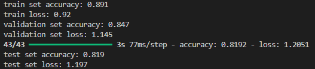
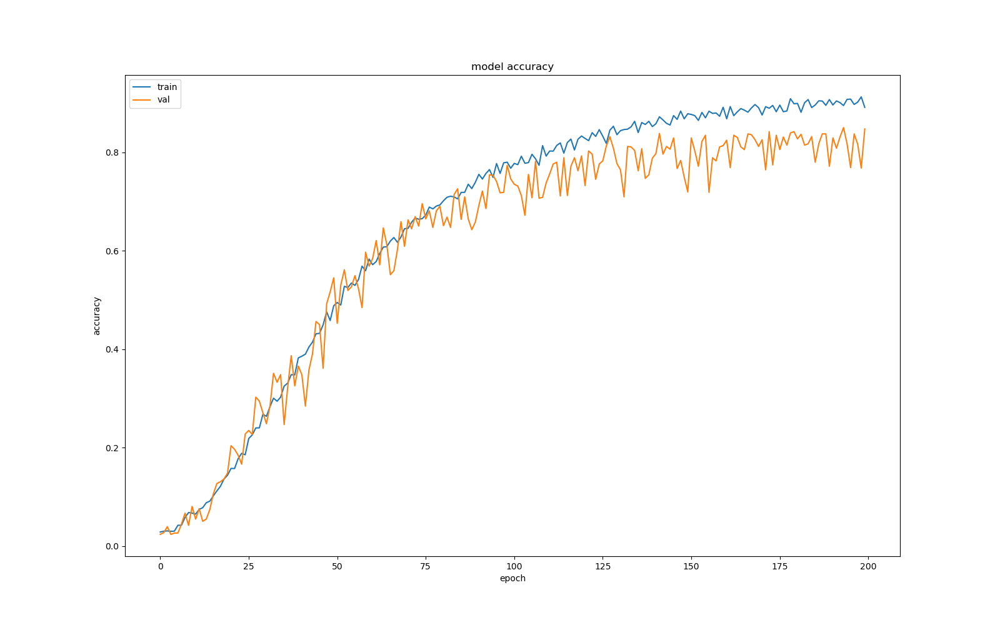

# Image Classification with Convolutional Neural Networks

This project demonstrates how to build and train a Convolutional Neural Network (CNN) for image classification using TensorFlow and Keras. The model is trained on a dataset of images, each labeled with one of 48 classes.

## Project Structure

- `image_classification.py`: Main Python script to build, train, and evaluate the CNN model.
- `famous48/`: Directory containing the dataset files (`x24x24.txt`, `y24x24.txt`, `z24x24.txt`).

## Requirements

- Python 3.x
- TensorFlow
- Keras
- NumPy
- scikit-learn
- Matplotlib

## Installation

1. Clone the repository:

   ```sh
   git clone https://github.com/wiktornazaruk/face_recognition.git
   cd face_recognition
   ```

2. Install the required Python packages:
   ```sh
   pip install tensorflow keras numpy scikit-learn matplotlib
   ```

## Dataset

The dataset consists of three text files (`x24x24.txt`, `y24x24.txt`, `z24x24.txt`) located in the `famous48` directory. Each file contains image data in a flattened format along with their corresponding labels.

## Usage

1. Run the `image_classification.py` script:

   ```sh
   python image_classification.py
   ```

2. The script will:
   - Read and preprocess the dataset.
   - Split the dataset into training and testing sets.
   - Build and train a CNN model.
   - Evaluate the model on the test set.
   - Plot the training and validation accuracy.

## Model Architecture

The CNN model is built using the Keras Sequential API and consists of the following layers:

- Input layer: Shape (24, 24, 1)
- Conv2D layer: 96 filters, kernel size 3x3, ReLU activation
- MaxPooling2D layer: Pool size 3x3, strides 2
- Dropout layer: 30%
- Conv2D layer: 256 filters, kernel size 5x5, ReLU activation
- MaxPooling2D layer: Pool size 3x3, strides 2
- Dropout layer: 40%
- Conv2D layer: 384 filters, kernel size 3x3, ReLU activation
- Dropout layer: 50%
- Conv2D layer: 384 filters, kernel size 3x3, ReLU activation
- MaxPooling2D layer: Pool size 3x3, strides 2
- Flatten layer
- Dropout layer: 60%
- Dense layer: 384 units, ReLU activation
- Dense layer: 48 units (number of classes), softmax activation

## Results

After training, the script prints the following metrics:

- Train set accuracy
- Train loss
- Validation set accuracy
- Validation set loss
- Test set accuracy
- Test set loss

It also plots the training and validation accuracy over epochs.

## Example Output




